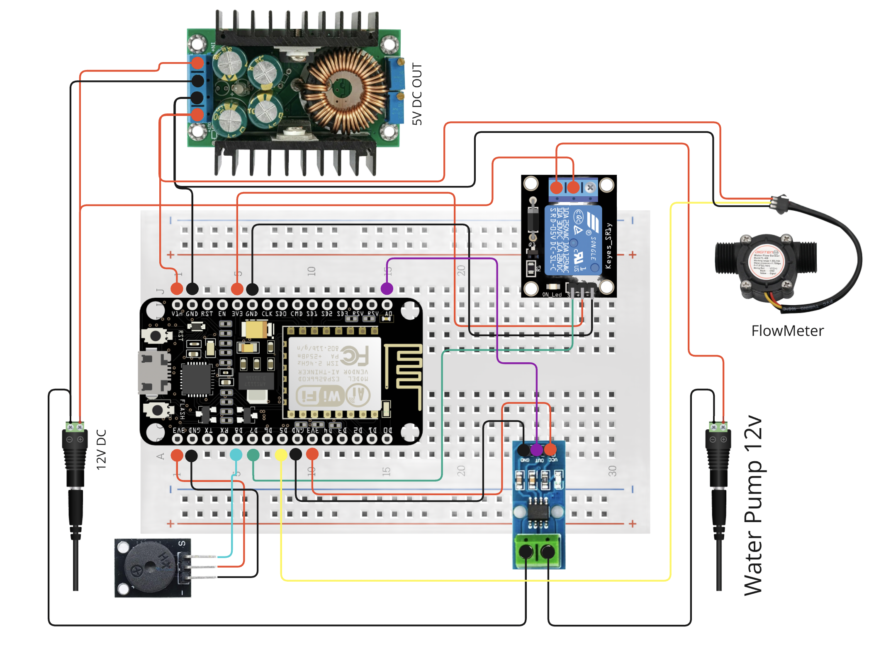

# IoT Water Flow Sensor Project

## Overview

This project is an IoT-based water flow monitoring and control system powered by an ESP8266 NodeMCU. The system provides real-time monitoring of water consumption, pump current readings, and pump control capabilities, fully integrated with Home Assistant (HA).

## Features

- **Real-time Water Flow Measurement**: Tracks water flow using the FL-408 impeller pulse sensor and sends data to Home Assistant.
- **Pump Current Monitoring**: Measures pump current using an ACS712-30 shunt sensor to ensure accurate status readings.
- **Pump Control**: Controls the water pump via an SRD-05VDC-SL-C relay with full control accessible through Home Assistant.
- **Dry-Run Protection**: Detects dry running of the pump and automatically shuts it down to prevent damage.
- **Home Assistant Auto-Integration**: Automatically registers the device via MQTT Discovery messages, including sensors and control buttons, with Home Assistant.
- **Over-the-Air (OTA) Firmware Updates**: Supports seamless firmware updates over Wi-Fi.

## Components

- **FL-408 Impeller Pulse Sensor**: Measures water flow rate in real time.
- **SRD-05VDC-SL-C Relay**: Controls the water pump.
- **KY-012 Buzzer**: Provides audible alerts for pump issues such as dry runs.
- **ACS712-30 Shunt Sensor**: Monitors the pump's electrical current.
- **PW821 Power Module**: Supplies stable power to the ESP8266 and other components.
- **ESP8266 NodeMCU v1**: The core microcontroller handling sensor data, pump control, and communication with Home Assistant.

## Installation and Setup

1. **Hardware Assembly**:

   - Connect the FL-408 sensor to the ESP8266 for water flow readings.
   - Wire the ACS712-30 sensor to measure the pump’s current.
   - Connect the SRD-05VDC-SL-C relay for pump control.
   - Attach the KY-012 buzzer for alerts.
   - Use the PW821 power module to power the ESP8266 and connected components.

2. **Firmware Installation**:

   - Install additional library to work with the shunt sensor — https://github.com/RobTillaart/ACS712/
   - Install additional library for timer tickers — https://github.com/natnqweb/Simpletimer
   - Flash the ESP8266 with the provided firmware using the Arduino IDE or similar tools.
   - Configure the firmware for Wi-Fi and Home Assistant integration (MQTT Broker IP-address and username/password).

3. **Home Assistant Integration**:

   - Upon powering up, the device will auto-register with Home Assistant.
   - Add the sensors and controls to your Home Assistant dashboard.

4. **OTA Updates**:

   - Use the built-in OTA feature to update firmware without physical access.
   - Access <ip-address_of_devices>:88/firmware to upload the firmware updates.
   - Access <ip-address_of_devices>:88/restart to reboot the device remotely.

## Usage

- Monitor water flow and pump status in real time via the Home Assistant dashboard.
- Control the pump directly from Home Assistant or through physical buttons connected to the device.
- Receive alerts and automatic pump shutdowns in case of dry runs.

## Safety and Maintenance

- Ensure all electrical connections are insulated and secure.
- Periodically check the sensors and relay for proper functioning.
- Use OTA updates to keep the firmware up to date with the latest features and fixes.

## Contributions

Feel free to contribute to this project by submitting issues, feature requests, or pull requests on the GitHub repository.

## License

This project is licensed under the MIT License. See the LICENSE file for details.

